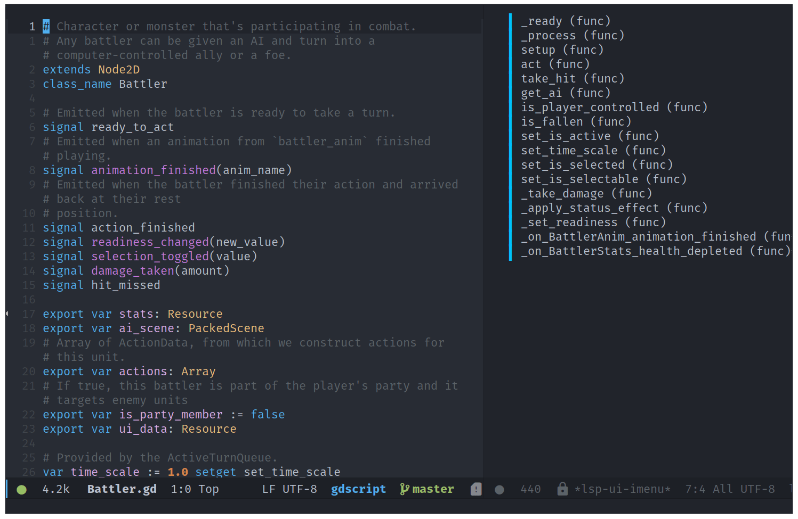
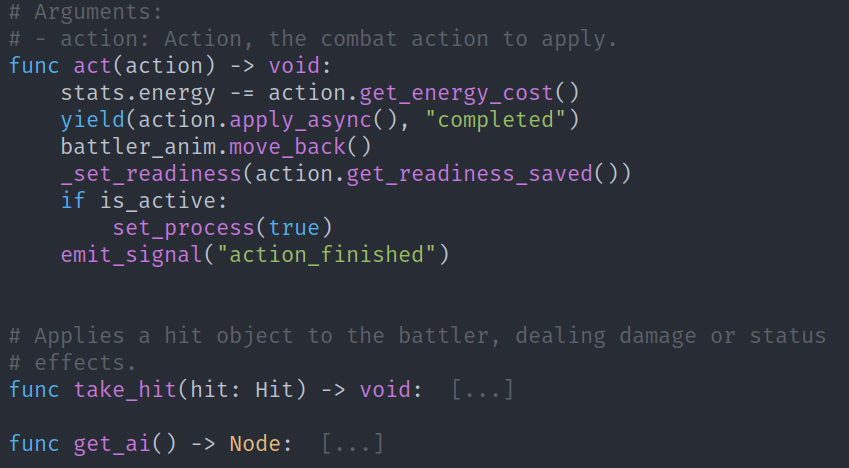
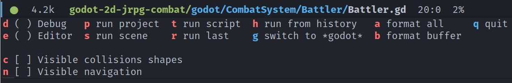

# GDScript mode for Emacs


This package adds support for the GDScript programming language from the Godot
game engine in Emacs. It gives syntax highlighting and indentations.
[Contributors](#contributing) are welcome!



<!-- markdown-toc start - Don't edit this section. Run M-x markdown-toc-refresh-toc -->

**Table of Contents**

- [Features](#features)
- [Contributing](#contributing)
- [How to install](#how-to-install)
  - [Installing in Spacemacs](#installing-in-spacemacs)
  - [Installing in Doom Emacs](#installing-in-doom-emacs)
  - [Installing with `use-package` + `straight.el`](#installing-with-use-package--straightel)
  - [Installing manually](#installing-manually)
- [Auto-completion with the Language Server Protocol (LSP)](#auto-completion-with-the-language-server-protocol-lsp)
- [How to use](#how-to-use)
  - [Opening the project in the editor](#opening-the-project-in-the-editor)
  - [Running Godot with visual debug options](#running-godot-with-visual-debug-options)
  - [Using Hydra](#using-hydra)
  - [Formatting code with gdformat](#formatting-code-with-gdformat)
  - [Browsing the Godot API with eww](#browsing-the-godot-api-with-eww)
- [Keyboard shortcuts](#keyboard-shortcuts)
- [Customization](#customization)
- [Using the debugger](#using-the-debugger)
  - [Adding and removing breakpoints](#adding-and-removing-breakpoints)
  - [Running the project with the debugger active](#running-the-project-with-the-debugger-active)
  - [Fetching an object's details](#fetching-an-objects-details)
  - [Debug Hydra](#debug-hydra)
  - [The `* Stack frame vars *` buffer](#the--stack-frame-vars--buffer)
  - [`* Inspector *` buffer](#-inspector--buffer)
  - [`* Stack dump *` buffer](#-stack-dump--buffer)
  - [`* Breakpoints *` buffer](#-breakpoints--buffer)
  - [`* Scene tree *` buffer](#-scene-tree--buffer)

<!-- markdown-toc end -->

## Features

This mode features all the essentials:

- Syntax highlighting.
- Code folding.
- Debugger support.
- [Imenu](https://www.gnu.org/software/emacs/manual/html_node/emacs/Imenu.html).
- Support for scenes (`.tscn`) and script (`.gd`) files.
- Comment wrapping when using `fill-paragraph`.
- Indentation and auto-indentation: tab-based (default) and space-based.
- Automatic pairing of parentheses, brackets, etc.
- Code formatting using
  [gdformat](https://github.com/scony/godot-gdscript-toolkit/).
- Auto-completion for all the keywords in the `gdscript-keywords.el` file.
- Run or open the project and files with Godot.
- Browsing the API reference in Emacs.



_Code folding in action._

## Contributing

Contributors are welcome! Check the [issues tab](issues) for tasks to work on and open a PR anytime.

If you find a bug or would like to suggest an improvement, [open a new
issue](issues/new).

For code style, we follow the [Emacs lisp style
guide](https://github.com/bbatsov/emacs-lisp-style-guide) by Bozhidar Batsov,
and the [tips and
conventions](https://www.gnu.org/software/emacs/manual/html_node/elisp/Tips.html)
from the Emacs manual.

You should also check for errors and linter warnings in your code. You can do so in Emacs with flymake or flycheck, but we recommend running the tool `makem.sh` provided with the repository:

```sh
./makem.sh lint-compile
```

This program will tell you if there is any problem with your code. If there's no output, everything is fine. You can run all tests like so, but note it might give you spelling errors that aren't relevant in this project:

```sh
./makem.sh all
```

## How to install

The package is available in the [MELPA](https://melpa.org/#/) package archive. Once you [set up MELPA](https://melpa.org/#/getting-started) you can install the package from Emacs:

```elisp
M-x package-install gdscript-mode
```

Then, in your init.el file, you can require the package:

```elisp
(require 'gdscript-mode)
```

### Installing in Spacemacs

1. Add the package to the `dotspacemacs-additional-packages`. You can find it under the dotspacemacs/layers function:

```elisp
(defun dotspacemacs/layers ()
  "Configuration Layers declaration..."
  (setq-default
   ;; ...
   dotspacemacs-additional-packages '(gdscript-mode)
   ;; ...
   ))
```

2. In your `dotspacemacs/user-config` function, require the package.

```elisp
(defun dotspacemacs/user-config ()
  (require 'gdscript-mode))
```

### Installing in Doom Emacs

Doom Emacs comes with a Godot GDScript module.

You just need to add the "lang: gdscript" keyword to your `.doom.d/init.el` file.

```elisp
:lang
(gdscript +lsp)          ; the language you waited for
```

The `+lsp` flag adds language server support for game development with Godot.

To see the module's documentation in Emacs, place your cursor over the word `gdscript` and press <kbd>k</kbd>.

### Installing with `use-package` + `straight.el`

Add the call to use-package to your Emacs configuration:

```elisp
(use-package gdscript-mode
    :straight (gdscript-mode
               :type git
               :host github
               :repo "godotengine/emacs-gdscript-mode"))
```

### Installing manually

1. Clone the repository or download a [stable release](https://github.com/godotengine/emacs-gdscript-mode/releases) to your computer.
1. In your init.el file, add a call to load and require the package.

```elisp
(add-to-list 'load-path "/path/to/gdscript-mode")
(require 'gdscript-mode)
```

## Auto-completion with the Language Server Protocol (LSP)

For auto-completion, we rely on the [lsp-mode](https://emacs-lsp.github.io/lsp-mode/) package and the GDScript language server, which is built into Godot.

The GDScript LSP support is part of the LSP mode. To use it, you need to install `lsp-mode` on top of `gdscript-mode` and configure it. To install and configure `lsp-mode`, see the [lsp-mode documentation](https://emacs-lsp.github.io/lsp-mode/page/installation/).

### Known issues

There are some known issues with the GDScript language server in Godot 3.2 due to the server being a bit young and not following the specification strictly. This mainly causes some `unknown notification` errors in lsp-mode at the moment. You can suppress them by adding the following code to your Emacs configuration (thanks to Franco Garcia for sharing this workaround):

```elisp
(defun lsp--gdscript-ignore-errors (original-function &rest args)
  "Ignore the error message resulting from Godot not replying to the `JSONRPC' request."
  (if (string-equal major-mode "gdscript-mode")
      (let ((json-data (nth 0 args)))
        (if (and (string= (gethash "jsonrpc" json-data "") "2.0")
                 (not (gethash "id" json-data nil))
                 (not (gethash "method" json-data nil)))
            nil ; (message "Method not found")
          (apply original-function args)))
    (apply original-function args)))
;; Runs the function `lsp--gdscript-ignore-errors` around `lsp--get-message-type` to suppress unknown notification errors.
(advice-add #'lsp--get-message-type :around #'lsp--gdscript-ignore-errors)
```

## How to use

### Opening the project in the editor

You can open the Godot editor with `M-x gdscript-godot-open-project-in-editor`, or open files and more in Godot with the `M-x gdscript-godot-*` commands.

By default, these commands try to use an executable named `godot` on the system [PATH environment variable](<https://en.wikipedia.org/wiki/PATH_(variable)>).

If you don't have `godot` available there, you can set a custom executable name or path to use instead:

```elisp
(setq gdscript-godot-executable "/path/to/godot")
```

You can also use `customize` to change this path: `M-x customize` and search for "godot".

### Running Godot with visual debug options

When running `gdscript-godot-run-project-debug`, you can use the universal argument <kbd>C-u</kbd> to invoke a mini-buffer with extra options to pass to godot.

Here are the available options:

1. `<no options>` _(default)_
2. `--debug-collisions`
3. `--debug-navigation`
4. `--debug-collisions --debug-navigation`

The last selected option is saved for the next time you call `gdscript-godot-run-project-debug`. To turn off debug options, you need to call the command with the universal argument again.

### Using Hydra

Running `gdscript-hydra-show` (<kbd>C-c r</kbd>) opens a [hydra](https://github.com/abo-abo/hydra) popup with options to open the editor or run the project, a scene, or a script, including with visual debug options.



_Hydra interactive menu to run the project and set debug options on the fly._

### Formatting code with gdformat

You can call the `gdscript-format` function to format the current buffer with
`gdformat`. Alternatively, `gdscript-format-all` will reformat all GDScript files in
the project. This feature requires the python package `gdtoolkit` to be installed
and available on the system's PATH variable.

You can install gdtoolkit using the pip package manager from Python 3. Run this
command in your shell to install it:

```
pip3 install gdtoolkit
```

### Browsing the Godot API with eww

With the point on a built-in class, you can press `C-c C-b o` to open the code reference for that class in the text browser [eww](https://www.gnu.org/software/emacs/manual/html_node/emacs/EWW.html).

To open the main API reference page and browse it, press `C-c C-b a`.

#### Using a local copy of the Godot docs

You can browse the API reference offline with `eww`. To do so:

1. Get a build of the official documentation. You can build it from the [godot docs repository](https://github.com/godotengine/godot-docs/) or [download a build](https://hugo.pro/projects/godot-builds/) from Hugo Lourcio's website.
2. Set `gdscript-docs-local-path` to the docs' directory, that contains the docs' `index.html` file.

For example:

```elisp
(setq gdscript-docs-local-path "/home/gdquest/Documents/docs/godot")
```

## Keyboard shortcuts

The following shortcuts are available by default:

- Inserting:
  - <kbd>C-c i</kbd> `gdscript-completion-insert-file-path-at-point`
- Formatting:
  - <kbd>C-c C-f r</kbd> `gdscript-format-region`
  - <kbd>C-c C-f b</kbd> `gdscript-format-buffer`
- Running the project and scenes in Godot:
  - <kbd>C-c C-r p</kbd> `gdscript-godot-open-project-in-editor`
  - <kbd>C-c C-r r</kbd> `gdscript-godot-run-project`
  - <kbd>C-c C-r d</kbd> `gdscript-godot-run-project-debug`
  - <kbd>C-c C-r s</kbd> `gdscript-godot-run-current-scene`
  - <kbd>C-c C-r q</kbd> `gdscript-godot-run-current-scene-debug`
  - <kbd>C-c C-r e</kbd> `gdscript-godot-edit-current-scene`
  - <kbd>C-c C-r x</kbd> `gdscript-godot-run-current-script`
- Browsing the code reference:
  - <kbd>C-c C-b a</kbd> `gdscript-docs-browse-api`
  - <kbd>C-c C-b o</kbd> `gdscript-docs-browse-symbol-at-point`
- Open hydra:
  - <kbd>C-c r</kbd> `gdscript-hydra-show` (require hydra package to be installed)
  - <kbd>C-c n</kbd> `gdscript-debug-hydra` (require hydra package to be installed)

## Customization

To find all GDScript-mode settings, press `M-x customize` and search for "gdscript".

Code example:

```elisp
(setq gdscript-use-tab-indents t) ;; If true, use tabs for indents. Default: t
(setq gdscript-indent-offset 4) ;; Controls the width of tab-based indents
(setq gdscript-godot-executable "/path/to/godot") ;; Use this executable instead of 'godot' to open the Godot editor.
(setq gdscript-gdformat-save-and-format t) ;; Save all buffers and format them with gdformat anytime Godot executable is run.
```

## Using the debugger

Emacs GDScript mode includes support for the GDScript debugger. You can use breakpoints, use code stepping functions, see your nodes' state at runtime, and more.

To get started with this feature, you need to add a least one breakpoint.

### Adding and removing breakpoints

Like in Godot's editor, you can toggle a breakpoint on the current line with `gdscript-debug-toggle-breakpoint` (<kbd>F9</kbd>).

After adding at least one breakpoint to the project, a buffer named `* Breakpoints *` is created. This buffer displays all existing breakpoints in a project. In that buffer, pressing <kbd>D</kbd> on a breakpoint line deletes the breakpoint. Pressing <kbd>RET</kbd> opens the corresponding GDScript file in another buffer.

### Running the project with the debugger active

When any breakpoint exists, running the project with `gdscript-godot-run-project` will automatically start the debugger's server if one isn't already running and connect to it.

The debugger's server runs on `localhost` through port `6010` by default. You can customize the port with the `gdscript-debug-port` variable.

Once Godot hits a breakpoint, Emacs displays two new buffers:

- `* Stack frame vars *` displays the locals, members, and globals variables for the current stack point. It shows the variable name, its type, and its value.
- `* Inspector *` displays detailed information about the selected object. By default, it shows the properties of `self`.

You can inspect any object in those two buffers by pressing <kbd>RET</kbd> on the corresponding line.

#### Multi-line display

You can toggle between one-line and multi-line display for values of type `Dictionary`, `PoolRealArray`, `PoolStringArray`, `PoolVector2Array`, `PoolVector3Array` and `PoolColorArray`. To do so, press `TAB` on the corresponding line.

### Fetching an object's details

Pressing <kbd>d</kbd> in `* Stack frame vars *` or `* Inspector *` buffers (or in the debug hydra) will fetch on the background data for all objects present in those two buffers and redisplay once done. Doing that adds two extra bits of information about the objects:

- Their real type, for example, `KinematicBody2D` instead of `ObjectId`.
- Their node path.

### Debug Hydra

If `hydra` is available, the debug hydra displays below `* Stack frame vars *` and `* Inspector *` buffers upon hitting a breakpoint.

You can also call it by pressing <kbd>C-c n</kbd>.

```
n next  c continue  m step  b breakpoints  s stack  v vars  i inspector  t scene-tree  d details
o pin   u unpin     q quit
```

- <kbd>n</kbd> - Steps to the next line of code.
- <kbd>c</kbd> - Continue program execution until the next breakpoint.
- <kbd>m</kbd> - Steps into the code.
- <kbd>s</kbd> - Shows the `* Stack dump *` buffer.
- <kbd>v</kbd> - Shows the `* Stack frame vars *` buffer.
- <kbd>i</kbd> - Shows the `* Inspector *` buffer.
- <kbd>t</kbd> - Shows the `* Scene tree *` buffer.
- <kbd>d</kbd> - Fetches details for all object present in the `* Stack frame vars *` and `* Inspector *` buffers and redisplay the buffers.
- <kbd>o</kbd> - Pins `self` in the `* Inspector *` buffer. It stays displayed until Godot frees the instance or you unpin it.
- <kbd>u</kbd> - Unpins the currently pinned object.
- <kbd>q</kbd> - Closes the debug hydra.

### The `* Stack frame vars *` buffer

The stack frame buffer displays the locals, members, and global variables for the current stack point. Here are available keyboard shortcuts:

- <kbd>TAB</kbd> toggles multi-line display for selected types.
- <kbd>RET</kbd> on an object line to display its details in the `* Inspector *`buffer.
- <kbd>l</kbd> displays the `* Stack dump *` buffer.
- <kbd>d</kbd> displays additional details for `ObjectId` variables.
- <kbd>p</kbd> goes to the previous line.
- <kbd>n</kbd> goes to the next line.
- <kbd>o</kbd> pins the current object in the `* Inspector *` buffer.
- <kbd>u</kbd> unpins the currently pinned object.
- <kbd>q</kbd> closes the buffer.

### `* Inspector *` buffer

Contains information about inspected object. By default `self` variable from `* Stack frame vars *` is displayed. The inspected object is kept in focus until you inspect another object or until the active object ceases to exists, in which case the current `self` is displayed instead.

- Press <kbd>TAB</kbd> to toggle multi-line display for selected typess.
- Press <kbd>RET</kbd> on object line to display its detailss.
- Press <kbd>RET</kbd> on `Node/path` line (second line from the top) to show given object in `* Scene Tree *` buffers.
- Press <kbd>l</kbd> deep in nested object to navigate one level up in the structure (ie. back). Pressing `l` while on top-level object displays `* Stack frame vars *` buffers.
- Press <kbd>d</kbd> to display additional details for object variabless.
- Press <kbd>p</kbd> to go to the previous lines.
- Press <kbd>n</kbd> to go to the next lines.
- Press <kbd>o</kbd> to pin current object in `* Inspector *` buffers.
- Press <kbd>u</kbd> to unpin currently pinned objects.
- Press <kbd>q</kbd> to close the buffers.

### `* Stack dump *` buffer

Contains stack dump information.

- Press <kbd>SPC</kbd> to jump to gdscript file where stack frame points to.
- Press <kbd>RET</kbd> to jump to the gdscript file and show `* Stack frame vars *`, `* Inspector *` buffers, and a debug hydra.
- Press <kbd>l</kbd> to display the `* Stack frame vars *` buffer.
- Press <kbd>p</kbd> to go to the previous line.
- Press <kbd>n</kbd> to go to the next line.
- Press <kbd>q</kbd> to close the buffer.

### `* Breakpoints *` buffer

Lists all existing breakpoints in the project.

- Press <kbd>SPC</kbd> to enable or disable all breakpoints.
- Press <kbd>RET</kbd> to jump to the file and line corresponding to the breakpoint..
- Press <kbd>TAB</kbd> to display the `* Stack dump *` buffer.
- Press <kbd>D</kbd> to delete the breakpoint.
- Press <kbd>q</kbd> to close the buffer.

### `* Scene tree *` buffer

Contains a tree visualisation of all objects in the running program.

- Press <kbd>RET</kbd> to open the corresponding object in the `* Inspector *` buffer.
- Press <kbd>p</kbd> to go to the previous line.
- Press <kbd>n</kbd> to go to the next line.
- Press <kbd>q</kbd> to close the buffer.
